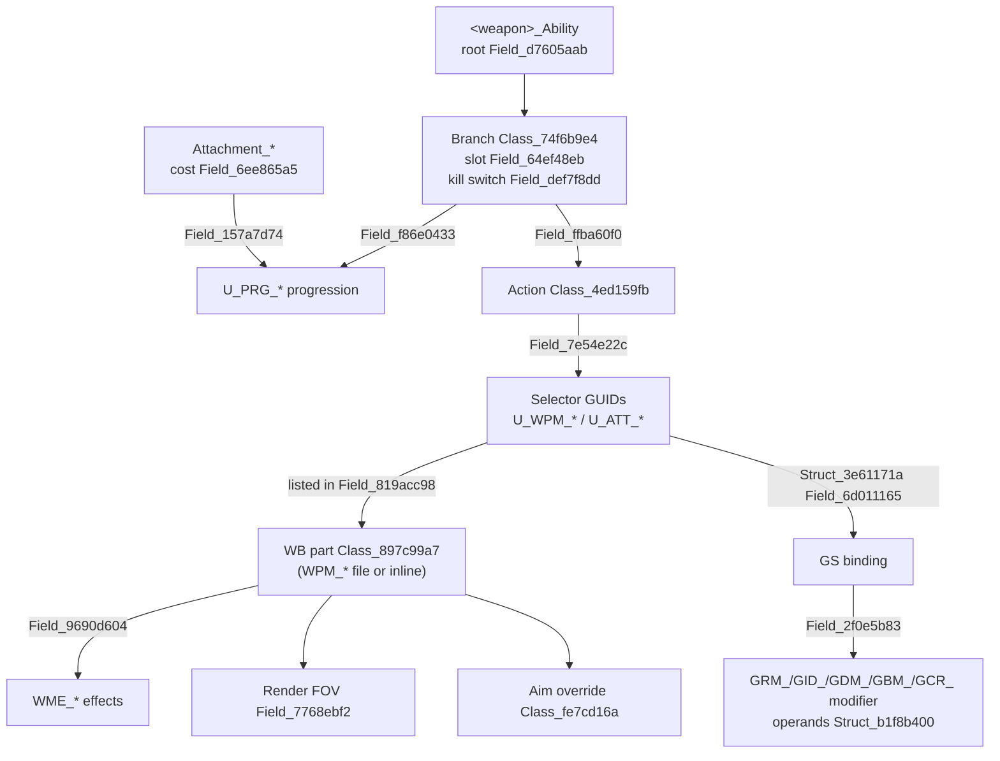

# How the Frosty assets link

[Frosty docs](README.md) · [Field map](FIELD_MAP.md) · [Weapons](WEAPONS.md) · [Attachments](ATTACHMENTS.md) · [UI text](UI_TEXT.md)

This page shows how the weapon and attachment assets connect, so you can go from a site
choice to the values that the game applies. Hash meanings are in the
[field map](FIELD_MAP.md). Links in the data show structure; they do not prove that the
game uses a branch at runtime.

## Asset families

| Prefix | Asset | Contents |
|---|---|---|
| `<weapon>_WB` | Weapon blueprint | Part list, render objects, default aim, projectile, fire logic |
| `GS_<weapon>` | Weapon stats | Recoil, dispersion, ADS/move indices, reload; selector bindings to modifiers |
| `<weapon>_Ability` | Weapon ability | Offered attachment branches, slots, kill switches, actions |
| `Equipment_<weapon>` | Equipment | Attachment list and prerequisite rules |
| `Attachment_<weapon>_<slot>_<name>` | Attachment | Cost, category, progression link |
| `U_PRG_*` | Progression unlock | The unlock that an ability branch uses |
| `U_WPM_*`, `U_ATT_*` | Selector unlocks | Package selectors (`U_WPM_*`) and model selectors (`U_ATT_*`) |
| `WPM_*` | Weapon part | Modifier package: effects, render object, aim override |
| `WME_*` | Weapon effect | One effect, for example ADS time or sway |
| `GRM_*`, `GID_*`, `GDM_*`, `GBM_*`, `GCR_*` | GS modifiers | Recoil, index, dispersion array, dispersion behavior, camera recoil |
| `PD_*` | Projectile | Damage curves, gravity, drag |
| `ZDA_*`, `FZT_*`, `AZT_*` | Shared arrays | Spread rows, zoom transitions |
| `Aim_*`, `_ZoomLevels/*` | Aim and zoom | Aim controller → zoom levels (magnification, camera FOV) |
| `AAM_<weapon>`, `AD_*` | UI metadata | Attachment names, labels and descriptions |
| `GRX_Weapons` | GameRemixer registry | Named values; source of most field names |

## Gadget routes (hotfix head 4892087)

The concussion grenade projectile `PBNS_ConcussionGrenade` directly imports
`SimEx_ConcussionGrenade_ApplyAffector`. That expression graph has a serialized
`Radius` input, but its boxed value is null and the pinned decoder does not resolve
its TypeRef. The directly imported `Affector_ConcussionGrenade` has no hotfix raw
capture in the reviewed tree. These links establish a candidate effect route, not
a numeric radius, duration, fuse time or native effect ([L142 receipt](../../reference-data/provenance/frosty-2026-09-29-L142-concussion-effect-envelope.json)).

The Flashbang WB imports two exports from `PBNS_Flashbang`, but the
scoped hash-named members do not identify a primary projectile. A captured
`ProjSimEx_Flashbang` directly imports `Affector_Flashbang`, without
a resolved path from the WB imports. Its checked operands do not provide
typed radius, duration or intensity values for comparison with Concussion.
The nonlethal-effect line is closed for this run after L142 and L155 yielded
no comparison proposal
([L155 receipt](../../reference-data/provenance/frosty-2026-09-29-L155-flashbang-effect-source.json)).

The defibrillator's hotfix `WM_Defib_FasterRechargePerk` contains a selector GUID
and one inline effect with raw f32 operands `1.5` and `1.0`. A separate ranked
revive affector stores six f32 values from `50` to `100`. The receiving fields,
units, multiplayer selection and runtime composition are unresolved. These
operands cannot yet support a recharge or revive comparison ([L139 receipt](../../reference-data/provenance/frosty-2026-09-29-L139-defibrillator-source.json)).

The deployed TUGS root links to `VEH_TUGS_Gameplay`, which links to
`SimEx_TUGS_DetectAndSpotTargets`. A selected graph object stores raw f32 values
`-1`, `-1` and `75`, and the expression resource is hash-verified. Its field
roles and executed operation are unknown; `75` is not an established scan range
([L140 receipt](../../reference-data/provenance/frosty-2026-09-29-L140-tugs-detection-source.json)).

Four hotfix Proximity Grenade roots form a candidate WB-to-projectile-to-
simulation route. A graph node stores the same raw f32 tuple `75`, `-1`, `-1`
in the same hash-named fields as TUGS. The WB projectile selector, graph-node
selection, field roles, units, and referenced resource contents remain
unresolved; the matching numbers do not establish matching detection behavior.
L140 and L158 yielded no source-backed detection comparison, so this line is
closed for this run
([L158 receipt](../../reference-data/provenance/frosty-2026-09-29-L158-proximity-source.json)).

The M18 Claymore, AT Mine and M4 SLAM hotfix projectile roots each link to their
own projectile feature and simulation graph. AT Mine and M4 SLAM also reference
the shared `DiceEx_Razer_GrenadeProximityTriggers`, whose hotfix raw body is not
captured. The selected simulation graphs have hash-named Boolean fields but no
identified activation-distance or lifetime operand. The traced links do not
support a trigger-radius comparison ([L138 receipt](../../reference-data/provenance/frosty-2026-09-29-L138-mine-trigger-source.json)).

The AT Mine and M4 SLAM projectile roots directly select in-file
`Class_9966532d` blast objects. Their mapped `BlastDamage` fields store
`300` and `100`, and `BlastRadius` stores `2` and `1`; Frag stores
`100` and `5` in the corresponding fields. The two mine blast objects
have a zero token in the field through which Frag selects its seven-point
falloff curve. This supports a conditional source-profile comparison for
operator review. Units, any other falloff route, effective damage composition
and runtime use remain unresolved
([L153 receipt](../../reference-data/provenance/frosty-2026-09-29-L153-mine-blast-source.json)).

The deployable-cover object imports its `DamageZones` asset and a shared
`Vehicle_Health` channel. Fifty f32 entries in the damage-zone asset are
raw-verified, but their roles and units are unnamed. The inspected Ability and
its direct children do not establish selection of that deployed object. No
entry is yet a source-backed cover HP or resistance value ([L141 receipt](../../reference-data/provenance/frosty-2026-09-29-L141-cover-durability-source.json)).

Three multiplayer launcher WB roots (RPG-7, MBT-LAW and M136 AT4) share a typed
ammo/reload owner and directly import deploy and movement arrays. Their
serialized `MagazineCapacity` values are all `1`; `NumberOfMagazines` values
are `3/3/2`, and `ReloadTime` values are `3.4/3.4/3.66`. The direct zoomed
movement arrays contain `0.45/0.4/0.45`; hip arrays contain `1.0` for all
three. The AT4 `NumberOfMagazines` operand was independently raw-checked at
offset 964 (`02000000`). Field names and direct joins support a source
comparison, but carried-round meaning, timing units, selector activation and
native behavior remain unresolved. The deploy tuples have unnamed roles.
These values are candidates for a launcher comparison after the active
selection and display labels are validated ([L137 receipt](../../reference-data/provenance/frosty-2026-09-29-L137-launcher-handling-ammunition.json)).

The RPG-7, MBT-LAW and M136 AT4 WBs select `PB_NS_RPG`,
`PB_MBTLAW` and `PB_AT4` as primary projectiles. Their directly
linked blast objects share the mapped field-owner identity from the
reviewed Frag source. `BlastDamage` stores `70/80/70`, and
`BlastRadius` stores `6/4/5`. This can extend the optional launcher
source-profile comparison. Two other projectile Float32 fields remain
hash-only in this owner context; they are not established speed or
lifetime values. Blast units, effective damage and runtime composition
remain unresolved
([L152 receipt](../../reference-data/provenance/frosty-2026-09-29-L152-launcher-projectile-source.json)).

The Breaching Dart `DrillGL_WB` primary selector imports the standard
`PB_40x46mmLVG_Drill` body. Its direct blast child stores mapped
`BlastDamage` 40, `BlastRadius` 1, `InnerBlastRadius` 1,
`ShockwaveDamage` 1, and `ShockwaveRadius` 7. A separate WB configuration
path references the gas body, which stores the same five values but is not
established as the default projectile. This supports a conditional serialized
source-profile comparison; units, direct-hit effects, effective damage and
runtime configuration remain unresolved
([L159 receipt](../../reference-data/provenance/frosty-2026-09-29-L159-breaching-dart-source.json)).

The tracer dart projectile `PB_NS_TracerDart` imports `SimEx_TracerDart`.
Two entries in that graph reference `Affector_LockingSignatureMultiplier_TracerDart`.
The affector stores a typed Float32 `11.0` beside Boolean `false`. The graph's
`Time To Live` node has a null boxed payload. The `11.0` field has no
established role or unit, and the links do not prove active application or
duration. No lock-signature comparison is supported yet ([L144 receipt](../../reference-data/provenance/frosty-2026-09-29-L144-tracer-dart-lock-source.json)).

The PLD Ability directly imports a jammable locking-type affector. Its deployed
locking and spotting graphs import two RemoteControlledLocking affectors and
MarkTarget_V2; the spotting graph's import array contains 55 children.
Across five scoped PLD roots, 52 Float32 candidates were raw-verified, and the
direct MarkTarget_V2 import has an additional unnamed Float32 `1.34`. No field
role or unit supports a lock-range, spotting-duration or magnitude comparison
with Tracer Dart's unnamed `11.0`. The serialized imports do not establish
runtime selection or composition. The marking line is closed for this run
after L144 and L149 yielded no comparison proposal
([L149 receipt](../../reference-data/provenance/frosty-2026-09-29-L149-pld-marking-source.json)).

The supply-crate Ability and three ammunition affectors are captured at the
hotfix head. The affectors hold 52 raw-verified primitive leaves, but their
hash-only fields do not identify a replenishment quantity or cadence. Two
direct children lack matching hotfix raw identities. The self-speedup callback
stores an unnamed `false` Boolean and its imported child stores an unnamed
`true` Boolean; neither establishes a condition. Direct imports do not prove
runtime resupply or reserve changes ([L143 receipt](../../reference-data/provenance/frosty-2026-09-29-L143-supply-crate-ammunition-source.json)).

The hotfix Supply Pouch WB and supply-sphere body directly reference the
named ammunition and healing affectors. These roots contain 46 ammunition
and 11 healing typed numeric or Boolean leaves, all raw-checked. Their
hash-named fields do not establish a quantity, cadence, or unit. The separate
`PRJ_SimEx_SupplyPouch` root was not reached by the bounded direct-import
trace. No Pouch-versus-Crate replenishment comparison is supported. This
closes the support-resupply line for this run after L143 and L157 produced
no comparison proposal
([L157 receipt](../../reference-data/provenance/frosty-2026-09-29-L157-supply-pouch-source.json)).

The multiplayer Frag Grenade and Mini V40 WB roots each select a PBNS primary
projectile, which links to a `Class_9966532d` blast object and a typed falloff
point list. The mapped `BlastDamage` fields store `100` and `40`; mapped
`BlastRadius` stores `5` for both. Frag selects seven falloff points and Mini
V40 selects five. These are serialized source comparisons; radius units,
curve interpolation and effective damage composition are unresolved. A
throwable comparison needs those validations before it can display gameplay
damage ([L148 receipt](../../reference-data/provenance/frosty-2026-09-29-L148-frag-miniv40-blast-source.json)).

The C4 WB selects `PNS_C4`, which selects an in-file
`Class_9966532d` blast object and the imported `BlastCurve_C4`.
The mapped `BlastDamage` and `BlastRadius` fields store `100` and
`3`, versus Frag's `100` and `5`; the C4 curve has eight typed
points versus Frag's seven. This supports a conditional source-profile
comparison. Units, interpolation, effective damage composition and runtime
use remain unresolved
([L151 receipt](../../reference-data/provenance/frosty-2026-09-29-L151-c4-blast-source.json)).

The Incendiary Grenade WB selects a PBNS projectile whose in-file blast child
stores mapped `BlastDamage=0` and `BlastRadius=4`. A separate captured
`SimEx_IncendiaryFireRadius` graph refers to two damage affectors, but the
scoped WB and PBNS trees do not directly import that graph or those affectors.
The selected blast values therefore do not describe fire damage or coverage.
Field units, any other selection route and runtime composition remain
unresolved
([L154 receipt](../../reference-data/provenance/frosty-2026-09-29-L154-incendiary-source.json)).

The Anti-Tank Grenade WB selects a PBNS projectile and an in-file
`Class_9966532d` blast object. Its mapped `BlastDamage` and
`BlastRadius` fields store `50` and `1.5`, versus Frag's `100`
and `5`. A linked four-row child has typed values but no verified
distance or damage labels; it is not a mapped falloff curve. The selected
blast fields support a conditional source-profile comparison, while units,
falloff interpretation, effective damage and runtime use remain unresolved
([L150 receipt](../../reference-data/provenance/frosty-2026-09-29-L150-antitank-blast-source.json)).

The multiplayer Throwing Knife WB selects
`ThrowingKnife_Projectile_v2` object 1. Its mapped `StartDamage`
and `EndDamage` are both `50`; mapped damage-falloff start/end
fields store `5/15`, `InitialSpeed` stores `350`, and
`TimeToLive` stores `10`. These support a conditional serialized
projectile profile for operator review. Units, effective hit damage,
trajectory and runtime composition remain unresolved
([L156 receipt](../../reference-data/provenance/frosty-2026-09-29-L156-throwing-knife-source.json)).

The spawn-beacon Ability directly imports three named children. Both captured
placed-object variants contain five matching raw f32 values, but the pinned
descriptor has two layouts under their `Class_9966532d` hash. The field-map
labels are candidates for these owners; neither multiplayer variant selection
nor beacon availability, health, lifetime or spawn benefit is established
([L145 receipt](../../reference-data/provenance/frosty-2026-09-29-L145-spawn-beacon-source.json)).

The standard and perimeter-defense smoke projectiles have identical bytes in
32 directly checked f32 fields. The perimeter-defense asset also references
the standard projectile. A separately captured `SimEx_SmokeBehaviour` stores
an unnamed f32 `10.0`, but the inspected Ability and projectiles do not
directly import it. One projectile child, `PF_Smoke_FirePutOut`, lacks a
matching hotfix capture. The checked values cannot yet be assigned cloud
coverage, persistence or runtime use ([L146 receipt](../../reference-data/provenance/frosty-2026-09-29-L146-smoke-grenade-source.json)).

`SimEx_TriggerAdrenalineShot` directly imports the named Suppression, Flak
and RemoveDebuffs affectors. Their hash-named payloads store i32 `-100`, f32
`0.8` and u32 `247138971`. The captured Adrenaline Shot Ability and its
directly imported `U_AdrenalineShot` do not link to that trigger in their
import tables. Payload roles, units, duration and activation remain
unresolved; none is an established utility benefit ([L147 receipt](../../reference-data/provenance/frosty-2026-09-29-L147-adrenaline-shot-source.json)).

The Gas Mask class-gadget Ability directly imports `U_GasMask_ClassGadget`.
A separately captured `SimEx_GasMask` graph imports
`RemoveAffector_Debuffs_FumigatorMask`, but the scoped Ability and WB do not
establish a selected path to that graph. Eight candidate scalar slots in the
SimEx element and affector are integer, enum, or Boolean fields with
unmapped roles; no protection magnitude or duration is sourced. The imports
do not establish runtime immunity or damage reduction
([L160 receipt](../../reference-data/provenance/frosty-2026-09-29-L160-gas-mask-source.json)).

The Adrenaline Shot and PTKM1R hotfix WBs each directly reference a deploy-time
array child. Their exact mapped WB fields both store `MagazineCapacity` 1,
`NumberOfMagazines` 1, and `ReloadTime` 0. The selected child tuples store
`0/0` and approximately `0.225/0.35`, respectively, but the tuple member
roles and units are unresolved. These fields do not establish carried uses,
gadget swap time, or a useful loadout comparison
([L161 receipt](../../reference-data/provenance/frosty-2026-09-29-L161-gadget-handling-source.json)).

**GPT-6.1 Sol, 29 September 2026 (L162; GPT-6.1 Sol workers, Low effort):**

The Stinger and IGLA WBs select their scoped NS projectiles by exact file/class GUID joins. Both store mapped `MagazineCapacity` 1, `NumberOfMagazines` 3 and `ReloadTime` 3.4. `ReloadTimeBulletsLeft` differs: 3.66/2.33. Their selected blast objects both store `BlastDamage` 100, `BlastRadius` 5, `InnerBlastRadius` 1, `ShockwaveDamage` 1 and `ShockwaveRadius` 7.5. This supports a conditional source profile. In owner `Struct_990616ac`, `Field_0bf4f62b` stores 350/500 and `Field_5ef7b9a1` stores 18/40; both remain unnamed. The L152 owner match establishes layout, not speed or lifetime semantics. Carried uses, reload phases, guidance, units and effective damage remain unresolved.
([L162 receipt](../../reference-data/provenance/frosty-2026-09-29-L162-stinger-igla-source.json)).

**GPT-6.1 Sol, 29 September 2026 (L163; GPT-6.1 Sol workers, Low effort):**

The Airburst Incendiary WB selects its primary PB by an exact GUID join and that PB selects local blast object 13. Mapped fields store `MagazineCapacity` 1, `NumberOfMagazines` 3, `ReloadTime` and `ReloadTimeBulletsLeft` 2.53, `BlastDamage` 1, `BlastRadius` 3, `InnerBlastRadius` 1, `ShockwaveDamage` 1 and `ShockwaveRadius` 3.5. No checked direct import from the scoped WB/PB bodies selects the separate lingering root; this does not prove runtime absence. Two projectile fields remain hash-only in both bodies. This supports a conditional primary source profile, while fire coverage, damage over time, resource meanings, timing units and runtime composition remain unresolved.
([L163 receipt](../../reference-data/provenance/frosty-2026-09-29-L163-airburst-incendiary-source.json)).

**GPT-6.1 Sol, 29 September 2026 (L164; GPT-6.1 Sol workers, Low effort):**

The M18 Claymore WB selects its scoped projectile wrapper; projectile object 1 selects local blast object 20. Its exact member-owner layout matches the reviewed L153 blast owner. Mapped fields store `InnerBlastRadius` 2.5, `BlastDamage` 1, `BlastRadius` 5, `ShockwaveDamage` 1 and `ShockwaveRadius` 7.5. Two selected curve pointers store zero tokens; this does not establish absence of every damage curve. The freshly decoded projectile has no `Class_23637dce` object, so no direct-damage labels were transferred. This supports a conditional serialized blast profile, not effective Claymore damage. Trigger findings from L138 remain unchanged; units, fragments and runtime composition are unresolved.
([L164 receipt](../../reference-data/provenance/frosty-2026-09-29-L164-claymore-blast-source.json)).

**GPT-6.1 Sol, 29 September 2026 (L165; GPT-6.1 Sol workers, Low effort):**

PTKM1R WB selects its deployed VB. The VB Shot selector points to a local `Class_23637dce` body with mapped Start/EndDamage 0/0 and falloff start/end 100/200. The separately captured CombatElement imports targeting (a reverse edge) and EFP, but no forward selection from the scoped targeting/deployed roots to CombatElement was established. CombatElement blast stores damage 0 and radius 5; EFP blast stores damage 160, inner radius approximately 3.99, radius 4 and shockwave radius 8. These are candidate profiles, not selected PTKM1R combat values. Compiled execution, units and effective anti-vehicle composition remain unresolved; this lead adds no site proposal.
([L165 receipt](../../reference-data/provenance/frosty-2026-09-29-L165-ptkm1r-projectile-source.json)).

**GPT-6.1 Sol, 29 September 2026 (L166; GPT-6.1 Sol workers, Low effort):**

For Frag, Mini V40, Anti-Tank Grenade, C4, Incendiary and Throwing Knife, the six WB roots store mapped `NumberOfMagazines` 1/2/2/3/1/5, `ReloadTime` approximately 0.1/0.1/0.1/0/0.1/0.1 and `ReloadTimeBulletsLeft` -1/-1/-1/0/-1/-1. Mapped WB `Shot.InitialSpeed.z` stores 25/35/25/9.5/25/approximately 44.973999. The z mapping is specific to the checked WB owner; no x/y labels or PBNS semantics were transferred. These source differences can accompany the earlier throwable damage profiles. They do not establish carried uses, seconds, physical throw speed or native launch behavior.
([L166 receipt](../../reference-data/provenance/frosty-2026-09-29-L166-throwable-ammo-launch-source.json)).

**GPT-6.1 Sol, 29 September 2026 (L167; GPT-6.1 Sol worker, Low effort):**

The captured Javelin WB configuration selects `PB_Javelin` by exact file/exported GUID joins. Mapped source fields store `MagazineCapacity` 1, `NumberOfMagazines` 3, `InitialAmmo` -1, and both reload time fields -1. The selected blast stores `InnerBlastRadius` 1, `BlastDamage` 125, `BlastRadius` 4, `ShockwaveDamage` 1 and `ShockwaveRadius` 6.5, with a checked link to the scoped curve configuration. Curve knot members remain unnamed; no interpolation formula is established. Laser-guided remains a separate candidate, with a different blast-owner descriptor that prevents name transfer. Current multiplayer availability, units, effective reload and damage composition remain unresolved.
([L167 receipt](../../reference-data/provenance/frosty-2026-09-29-L167-javelin-source.json)).

**GPT-6.1 Sol, 29 September 2026 (L168; GPT-6.1 Sol worker, Low effort):**

Panzerfaust3 WB PrimaryFire.Shot selects `PB_Panzerfaust3`. The DM32 offered selector binds a WB modifier that selects `PB_Panzerfaust3_DM32`; the DM12A1 selector changes shot tuning, so baseline applicability remains conditional on fallback/composition. The two direct blast owners store mapped `BlastDamage` 130/230, `BlastRadius` 5/5 and `InnerBlastRadius` 1/1. The WB stores MagazineCapacity/NumberOfMagazines/InitialAmmo 1/3/-1, and both reload time fields approximately 4.96. This supports a conditional variant source comparison, not a default selection, effective damage or reload duration. Current equip availability and native composition remain unresolved.
([L168 receipt](../../reference-data/provenance/frosty-2026-09-29-L168-panzerfaust3-source.json)).

**GPT-6.1 Sol, 29 September 2026 (L169; GPT-6.1 Sol worker, Low effort):**

The Deployable Mortar WB imports its VB. Two VB component-to-firing chains select exact exported M720A1 and M722 payload owners. Their mapped MagazineCapacity/NumberOfMagazines/InitialAmmo tuples are 1/-1/-1 and 1/3/0. Both store `ReloadTime` 4 and `ReloadTimeBulletsLeft` -1. Selected M720A1 InnerBlastRadius/BlastDamage/BlastRadius are approximately 2.444/60/7.622; M722 stores 1/0/5. The persistent-ammo zero fields remain unnamed and are not joined to the firing owners. Negative sentinels do not prove unlimited ammunition, and zero blast damage does not prove absence of all effects. Current availability, units, trajectory, effective timing and composition remain unresolved.
([L169 receipt](../../reference-data/provenance/frosty-2026-09-29-L169-mortar-source.json)).

**GPT-6.1 Sol, 29 September 2026 (L170; GPT-6.1 Sol worker, Low effort):**

Recon WB primary deployment selects `VEH_Drone`; a separate local selector points to PayloadDrone. The checked payload branch selects its bomb blast owner, which stores InnerBlastRadius/BlastDamage/BlastRadius/ShockwaveDamage/ShockwaveRadius 1.5/100/5/1/7.5. A distinct recon vehicle blast owner stores 1/0/5/1/15. The Lancet feature expression constant imports `PBNS_LancetExplosion`, whose corresponding tuple is 1/25/4/1/7.5, but constant presence does not prove a compiled spawn consumer. Lancet WB primary Shot separately selects PD_9x19mm. Only the checked payload configuration supports a conditional source-profile proposal. Current availability, default/branch activation, durability, speed, range and effective composition remain unresolved.
([L170 receipt](../../reference-data/provenance/frosty-2026-09-29-L170-drone-payload-source.json)).

**GPT-6.1 Sol, 29 September 2026 (L171; GPT-6.1 Sol worker, Low effort):**

MPAPS and EIDOS WB pointers select the corresponding vehicles. Both vehicles select the shared EIDOS motion machine, but its checked direct import table does not connect to either scoped SimEx root; indirect/resource consumers remain unresolved. A separate exact root-to-selected-firing-owner trace establishes mapped resource owners matching L137. Both store MagazineCapacity/NumberOfMagazines/InitialAmmo 1/1/-1; `ReloadTime` is 0/0.5 and `ReloadTimeBulletsLeft` is 0/0. These source fields support a conditional resource profile. Graph label/type associations remain captured-decoder evidence. Interception count, protection radius, resource meanings, timing units and native behavior remain unresolved.
([L171 receipt](../../reference-data/provenance/frosty-2026-09-29-L171-mpaps-eidos-resource-source.json)).

**GPT-6.1 Sol, 29 September 2026 (L172; GPT-6.1 Sol worker, Low effort):**

EOD Bot deployment connects through exact VB slot imports to demolition and mine weapon-feature owners. Their Shot selectors choose the checked MainMunition and mine projectiles, each with a direct mapped blast child. Demolition InnerBlastRadius/BlastDamage/BlastRadius/ShockwaveDamage/ShockwaveRadius are approximately 4.99/5/4/1/11.5; mine values are approximately 1.99/150/2/1/4.5. Deployment/demolition/mine ammo tuples are 1/1/-1, 1/2/-1 and 1/3/-1. The main projectile feature imports a generic cluster consumer that references the exact EOD submunition blueprint; the same consumer also references M320 submunition. A checked consumer reference does not establish compiled condition selection or fragment activation. Availability, units and effective composition remain unresolved.
([L172 receipt](../../reference-data/provenance/frosty-2026-09-29-L172-eodbot-payload-source.json)).

**GPT-6.1 Sol, 29 September 2026 (L173; GPT-6.1 Sol worker, Low effort):**

Mobile Jammer WB mapped MagazineCapacity/NumberOfMagazines/InitialAmmo are 1/1/-1. AutoReplenishMagazine is true, AutoReplenishRounds is -1 and AutoReplenishDelay is 45. Exact WB Shot references select scoped PBNS exports; the Gameplay body references SimEx, whose operand table references two captured jammer affectors. These forward source references do not prove compiled execution. Affector fields remain unnamed; a named Radius interface default is not an effective radius. This supports a conditional resource source profile, while refill timing, radius, duration, percentages, current availability and native activation remain unresolved.
([L173 receipt](../../reference-data/provenance/frosty-2026-09-29-L173-mobile-jammer-source.json)).

**GPT-6.1 Sol, 29 September 2026 (L174; GPT-6.1 Sol worker, Low effort):**

Repair Tool WB selected local configuration path 0 to 6 to 10 to firing owner 2 selects local Class_23637dce projectile object 1. In that checked owner context, mapped StartDamage/EndDamage store 13/13 and falloff start/end store 100/200; four damage-curve pointers are null. The SimEx operand table has a checked forward reference to the damage affector, without proof of compiled execution. The separately captured HealVehicle root remains a named candidate without selected healing route. This supports a conditional direct-damage source profile. Damage per second, hit frequency, vehicle-damage composition, repair rate, units and current availability remain unresolved.
([L174 receipt](../../reference-data/provenance/frosty-2026-09-29-L174-repair-tool-source.json)).

**GPT-6.1 Sol, 29 September 2026 (L175; GPT-6.1 Sol worker, Low effort):**

The captured Minigun WB selects an internal firing owner and PD_556x45mmNATO_Minigun. Mapped source fields store MagazineCapacity 250, NumberOfMagazines 1, InitialAmmo -1, RateOfFire approximately 1799.999023, ReloadTime approximately 6.699999809 and ReloadTimeBulletsLeft approximately 5.829999924. The selected projectile curve associated with the historical health mapping has points approximately (0,26.05), (21,26.05), (21,20.67), (75,20.67), (75,17.13); a distinct armor curve must remain separate. Exact typed layout and historical field mappings do not independently prove current gadget consumer semantics. This supports a conditional firing/resource source profile; current availability, effective cadence/reload, curve composition and damage calculations remain unresolved.
([L175 receipt](../../reference-data/provenance/frosty-2026-09-29-L175-minigun-source.json)).

**GPT-6.1 Sol, 29 September 2026 (L176; GPT-6.1 Sol worker, Low effort):**

The four checked hotfix WB chains have exact Ammo/Reload member owners matching L137 and a checked WB Shot.InitialSpeed owner matching L166. NumberOfMagazines is 1/1/2/1 for Concussion/Flashbang/Smoke/Proximity. ReloadTime is approximately 0.1 and ReloadTimeBulletsLeft is -1 in all four; mapped Shot.InitialSpeed.z is 25 in all four. These are conditional resource/launch source fields. They do not establish carried uses, seconds or physical throw speed. Effect radius, duration, intensity and native composition remain unresolved; prior closed effect lines are not reopened.
([L176 receipt](../../reference-data/provenance/frosty-2026-09-29-L176-utility-throwable-resource-source.json)).

**GPT-6.1 Sol, 29 September 2026 (L177; GPT-6.1 Sol worker, Low effort):**

The checked non-Granite Vehicle Supply Crate WB deployment import selects the deployed VB, which selects gameplay, setup and FeatureEx objects. The selected firing owner stores MagazineCapacity/NumberOfMagazines/InitialAmmo 1/1/-1 and ReloadTime/ReloadTimeBulletsLeft 1000/1000, with ReloadThreshold -1; an alternative firing block stores the same values. The captured affector selects its success object. FeatureEx retains compiled resource and construction/VFX imports, without a completed typed refill or repair consumer. This supports only a conditional resource/deployment source profile. Values do not establish effective reload, cooldown, refill quantity, repair rate or radius. Current availability and native utility composition remain unresolved.
([L177 receipt](../../reference-data/provenance/frosty-2026-09-29-L177-vehicle-supply-crate-source.json)).

**GPT-6.1 Sol, 29 September 2026 (L178; GPT-6.1 Sol worker, Low effort):**

Ladder WB local object 2 imports the actor; the checked actor component references the deployed Ladder, with separate mesh, physics and LadderConfig references. Ability imports U_Ladder. Active PrimaryFire/Shot selection and Ability activation remain unresolved. This is a partial structural finding with no comparison-ready numeric fields. No height, climb speed, durability, units or current availability follows from the filename or transforms.
([L178 receipt](../../reference-data/provenance/frosty-2026-09-29-L178-ladder-deployment-source.json)).

**GPT-6.1 Sol, 29 September 2026 (L180; GPT-6.1 Sol worker, Low effort):**

The fresh Railgun WB selected local chain 0 to 9 to 14 to 1 selects the exact exported PD_Railgun object 2. Context-mapped source fields store MagazineCapacity/NumberOfMagazines/InitialAmmo 1/11/-1, RateOfFire approximately 299.989990, ReloadTime approximately 4.265999794 and ReloadTimeBulletsLeft -1. The selected projectile stores StartDamage/EndDamage 150/150 and DamageFalloffStartDistance/EndDistance 100/200; the checked health damage-curve pointer is null. This supports a conditional firing/resource/direct-damage source profile. Current availability, units, effective cadence, charge time, penetration and damage composition remain unresolved. The receipt preserves the disclosed helper/decode revision history limits.
([L180 receipt](../../reference-data/provenance/frosty-2026-09-29-L180-railgun-source.json)).

**GPT-6.1 Sol, 29 September 2026 (L179; GPT-6.1 Sol worker, Low effort):**

Ten fresh Soft/Ceramic Armor roots and two requested resource children were examined. Ability/affector imports join distinct exported Class_bc0062dc resource owners. Each selects an internal Class_e923016e object containing the same two external channel GUID pairs. Both SimEx roots import the SoldierArmorVestTier affector. WB-to-Ability selection remains unresolved. This is a partial source-structure finding without comparison-ready protection values. Named protection consumers, compiled activation, mode/current multiplayer availability and all protection amounts remain unresolved.
([L179 receipt](../../reference-data/provenance/frosty-2026-09-29-L179-armor-resource-joins.json)).

**GPT-6.1 Sol, 29 September 2026 (L181; GPT-6.1 Sol worker, Low effort):**

The Squad Revive Ability imports join exact CanReviveTeam_WithGadget, CanReviveSquad_WithAbility and CanReviveTeam_WithAbility exports in the newly captured SoldierOnlyPublicChannels body. The DiceEx selected inputs join ReviveState, ReviveTime and Deathflow.ReviveTotalTime. Export identities, import pointers/GUID pairs, channel strings and nested port typeRef words were raw-checked. Named ports are Reviving, RevivingProgress and IsFastRevive. RID 859005a3c80cf7f7 remains a selected resource reference; no compiled execution or formula is established. This partial source-structure finding supports no numeric revive profile. Health restored, duration units, distance and current availability remain unresolved.
([L181 receipt](../../reference-data/provenance/frosty-2026-09-29-L181-squad-revive-channel-joins.json)).

**GPT-6.1 Sol, 29 September 2026 (L182; GPT-6.1 Sol worker, Low effort):**

The checked MP NVG WB pointer chain reaches an exact mapped Ammo owner. MagazineCapacity, NumberOfMagazines, InitialAmmo and AutoReplenishRounds store -1; AutoReplenishMagazine is false. Ability resolves to the freshly captured U_NVG_MP export. Two WB graph endpoints join exact exported client VE objects. SimEx selects resource identifier 902febcb2fb7b83b. This supports a conditional resource source profile, without battery capacity, depletion duration, refill timing, vision benefit, compiled execution or current multiplayer availability. Negative sentinels are preserved without gameplay interpretation.
([L182 receipt](../../reference-data/provenance/frosty-2026-09-29-L182-nvg-resource-source.json)).

**GPT-6.1 Sol, 29 September 2026 (L183; GPT-6.1 Sol worker, Low effort):**

Both newly captured hotfix gadget registries decode with zero unresolved types in the checked decoder. The main GRX registry is byte-identical to L78. Six retained anchors contain two named ProjectileEntityData member pairs and four utility labels. The projectile names do not name the different Struct_990616ac owner, whose previously unresolved meanings remain unresolved. Utility labels have no selected source consumer join in this scope. This is a reviewed mapping-limit finding, with no new gadget mechanic meaning or site proposal. Do not repeat this registry route without changed bytes or a concrete new owner/consumer join.
([L183 receipt](../../reference-data/provenance/frosty-2026-09-29-L183-hotfix-gadget-registry-anchors.json)).

**GPT-6.1 Sol, 29 September 2026 (L184; GPT-6.1 Sol worker, Low effort):**

A bounded catalog pass classified 66 unreviewed family prefixes. Root review retains 29 positive gameplay source candidate prefixes, 25 containing only Art routes in the listed prefix, two with art/UI or ambiguous roots, and ten with shared or ambiguous routes. CorpseDropAmmo was corrected from art-only to ambiguous because projectile object routes outside Art do not establish an art-only scope. A presentation crosshair containing Ability in its name is UI; SimEx_DestroyUAVCallInWeaponAbility is an expression candidate. Their names do not establish Ability roots. Candidate capture identities were checked with both hotfix Head and descriptor. These classifications select next positive source traces and retain gaps; they do not prove no gameplay elsewhere, aliases, current availability or completed gadget mechanics.
([L184 receipt](../../reference-data/provenance/frosty-2026-09-29-L184-gadget-coverage-gaps.json)).

**GPT-6.1 Sol, 29 September 2026 (L185; GPT-6.1 Sol worker, Low effort):**

The selected repair expression imports Affector_VehicleRepair. Its first effect references the exact registry child named RepairTool_Default_Repair Amount Per Second and U_Gadget_RepairTool_Affector_VehicleRepair. The named owner stores raw float members 40/0/250, whose value-slot roles are unresolved; 40 is not a verified effective health-per-second value. The wrapper selects the exact CT_GLA child Ignore_Damage, a configuration token rather than a vehicle-health receiver. SimEx retains named IsHealingVehicle, HasTarget, Target, FiringStarted and FirstRepairQueryDone ports. Its selected compiled body is present and hash-verified, without verified operation grammar or native execution. The separate HealVehicle affector is not the directly selected SimEx affector. This is useful qualitative repair-source evidence, with parameter meanings, health receiver, rate, activation and availability unresolved.
([L185 receipt](../../reference-data/provenance/frosty-2026-09-29-L185-repair-utility-consumer.json)).

**GPT-6.1 Sol, 29 September 2026 (L186; GPT-6.1 Sol worker, Low effort):**

Supply Crate WB imports the exact PB projectile instances, which select ProjectileFeature_SupplyCrate and PRJ_SimEx_SupplyCrate. The expression selects RID 2fccf1c1ece25719; the captured 128-byte compiled body is hash-verified. The projectile separately selects Affector_Ammunition_AmmoCrate and Affector_SupplyBase; the ammunition affector selects U_Gadget_AmmoBox_Affector_Ammo. That child provides a named selector token, without a named amount or cadence receiver. No selected scoped import joins the inspected shared channel body. Granite and SP_Squad routes remain separate. This bounded utility-source trace does not establish health restoration, ammo quantity, cadence, effective radius or activation, and does not prove their absence. Compiled graph grammar and exact receiving-member meanings remain unresolved.
([L186 receipt](../../reference-data/provenance/frosty-2026-09-29-L186-supply-utility-consumer.json)).

**GPT-6.1 Sol, 29 September 2026 (L187; GPT-6.1 Sol worker, Low effort):**

Defibrillator selected Ability arrays assign IsReviving, Deathflow.CanReviveTeam and Defibrillator_ManuallyEquipped true through exact named Boolean channel joins. The scoped SimEx exposes typed charge/rank ports including CurrentChargeProgression, ActualHoldTime and ChargeRank; its selected compiled binding joins ReviverPlayerId. The exact selected compiled RID af379644109d7d8d body is captured and hash-verified. Six ranked affector entries remain unnamed. These source state/port assignments do not establish restored-health amount, charge-to-health formula, duration units, native activation or current availability. Serialized Granite mode conditions remain scoped configuration facts, without active-mode assignment.
([L187 receipt](../../reference-data/provenance/frosty-2026-09-29-L187-defibrillator-revive-consumer.json)).

**GPT-6.1 Sol, 29 September 2026 (L188; GPT-6.1 Sol worker, Low effort):**

AssaultLadderConfig selects exact gadget interaction enable/callback graphs and a distinct LadderTop interaction. The LadderTop graph imports exact named CurrentAction, WasClimbing_BlockFetures_Delay, MeleeState and CurrentStance exports. Preserve the source spelling. The three selected compiled interaction bodies are hash-verified. This extends the actor/mesh-only L178 evidence to qualitative interaction dependencies, without established condition/callback operations. No usable height, climb speed, placement threshold, extension range, durability, protection, native activation or units follows from this trace.
([L188 receipt](../../reference-data/provenance/frosty-2026-09-29-L188-assault-ladder-interaction.json)).

**GPT-6.1 Sol, 29 September 2026 (L189; GPT-6.1 Sol worker, Low effort):**

Deployable Cover WB configuration selects the exact exported deployed vehicle through checked local pointers and GUID joins. The vehicle connects to DamageZones, shared Vehicle_Health and FeatureEx; FeatureEx connects to SimEx. Both selected compiled bodies are present and hash-verified. This establishes the selected source configuration and qualitative health/protection dependencies beyond L141. No named protection or destruction numeric operand, HP, resistance, effective protection, native activation or current availability is established. The missing step is exact serialized graph grammar and node/channel/member meaning, rather than absent compiled bytes.
([L189 receipt](../../reference-data/provenance/frosty-2026-09-29-L189-deployable-cover-protection-consumer.json)).

**GPT-6.1 Sol, 29 September 2026 (L190; GPT-6.1 Sol worker, Low effort):**

The exact selected repair, supply and revive compiled bodies are captured and independently hash-verified. The combined inspected SDK/plugin/editor source scope contains the SerializedExpressionNodeGraph type enum, raw stream retrieval, generic GetResAs requiring a Resource subclass, and handler dispatch by resource type. The saved proof includes inspected Resource subclasses and registrations. No graph-specific reader, matching registration or independently known operation control was established within that scope; no semantic parser was attempted. This is a source/tooling limit, not proof of global reader absence or missing game behavior. Utility grammar, receiving members, formulas and native activation remain unresolved. Reopen with a verified reader and independent operation control.
([L190 receipt](../../reference-data/provenance/frosty-2026-09-29-L190-utility-compiled-reader-gate.json)).

**GPT-6.1 Sol, 29 September 2026 (L191; GPT-6.1 Sol worker, Low effort):**

The UAV Overwatch Ability selects exact U_UAVOverwatch and DiceFeature exports. DiceFeature selects SimEx_CallIns_UAVOverwatch, whose captured function table names ability state/owner, weapon ammunition/event state and channel functions. Two separately inspected MQ9 gameplay/spotting expressions remain candidate sources because no deployment selection joins them. The candidate Spot_Trigger stores a named boxed SpotDuration default 2.0 and UseRootTransform true; these are source defaults, without established units, effective duration, coverage or activation. Two candidate compiled resource bodies are independently hash-verified. Their grammar and the UAV deployment-to-spotting consumer remain unresolved. This partial qualitative source finding does not establish current availability or native spotting behavior.
([L191 receipt](../../reference-data/provenance/frosty-2026-09-29-L191-uav-overwatch-utility-consumer.json)).

**GPT-6.1 Sol, 29 September 2026 (L193; GPT-6.1 Sol worker, Low effort):**

Decoy WB Shot selects the exact newly captured PB_Decoy exported projectile and blueprint. Its local component list selects a sound consumer that imports BF03_Gadgets_Decoy_FakeWeapon_Patch_01. DiceFeature selects exact PresEx_Decoy, which retains TriggerSoundEventNode and UpdateDiceSoundVelocity labels and ResourceRef 7e02fe108e6f5d2f. The sound source reference and method names do not prove event conditions or native playback. Sniper Decoy WB selects PB_DecoyDeploy and its deployment feature, with exact simulation/presentation expression references. Two deployment resource bodies are hash-verified by catalog-name mapping; a renewed typed expression-to-RID join is not established for them. Source spotting labels and the separate no-glint configuration remain source facts without effective spotting benefit or default choice. Utility activation, lifetime, sound range, compiled conditions and current availability remain unresolved.
([L193 receipt](../../reference-data/provenance/frosty-2026-09-29-L193-decoy-utility-consumer.json)).

**GPT-6.1 Sol, 29 September 2026 (L192; GPT-6.1 Sol worker, Low effort):**

SupplyDrop WB baseline Shot selects the exact Resupply marker and blueprint exports. The marker component selects SimEx_AirDrop_SpawnAirDrop and its ResourceRef caafa6681a928175. MobileRespawn WB Shot selects a local deployment wrapper whose exact import selects VEH_Tool_SpawnBeacon_BR. Its component selects FeatureEx_VEH_Tool_MobileRespawn and ResourceRef d2c2f890a61e3751. Both gameplay resource bodies are captured and independently hash/size-verified. The distinct Ability-to-resource/DiceFeature joins select presentation expressions, with separate presentation RIDs. These are selected source chains without a completed configuration-to-WB binding or compiled operation grammar. Other airdrop payload overrides remain conditional. No refill amount, healing benefit, respawn eligibility, player count, range, cooldown, native deployment or current availability is established.
([L192 receipt](../../reference-data/provenance/frosty-2026-09-29-L192-logistics-utility-consumer.json)).

**GPT-6.1 Sol, 29 September 2026 (L194; GPT-6.1 Sol worker, Low effort):**

The SupplyCrate and separate FireSupport blueprint roots select local owners whose pointer/import pairs reference the exact MedicCrate healing affector. The owner layouts remain ambiguous; positive raw pointer evidence does not validate their other fields. This adds a named healing-source link to the ammo-source evidence in L186. ActiveMedic separately binds the same affector twice and selects compiled RID 196e489adbfbb9b5, whose body is hash-verified. The affector selects U_Gadget_MedicCrate_Affector_Healing, whose exact CT_GLA child is Ignore_Damage, a configuration token rather than a proven health receiver. No healing amount, rate, cadence, radius, compiled activation, availability or native benefit follows from these joins. FireSupport and ActiveMedic remain separate contexts.
([L194 receipt](../../reference-data/provenance/frosty-2026-09-29-L194-medic-crate-healing-consumer.json)).

**GPT-6.1 Sol, 29 September 2026 (L195; GPT-6.1 Sol worker, Low effort):**

Exact Equipment-to-Ability-to-CUST imports select shared WB_M320 and MD_M320GL_Smoke. The WB contains distinct offered entries whose pointer/import pairs reference the standard and Hemostatic_TEMP smoke projectile and blueprint exports. The inspected MD configuration does not establish which offered entry is active. Its slot/resource references are retained separately. These source options do not prove the selected/default smoke variant, healing or concealment benefit, lifetime, radius, native execution or current availability. No numeric mechanic is assigned. The shared WB owner layout and unresolved selected modifier path remain limits on effective payload composition.
([L195 receipt](../../reference-data/provenance/frosty-2026-09-29-L195-m320-smoke-selection.json)).

**GPT-6.1 Sol, 29 September 2026 (L197; GPT-6.1 Sol worker, Low effort):**

Eight scoped Laser Designator configuration/modifier roots were inspected. Three MD object 10 Field_7085d5e0 imports join distinct exact normal, SmokeScreen and Artillery U token exports. These are configuration identity joins without a selected targeting/support receiver or numeric mechanic. The inspected GS anonymous numbers remain unassigned. Fresh roots are absent from the frozen reverse-import index, so an absent indexed caller is a capture-index limitation. No locking range, targeting time, support/default activation, current availability or native behavior is established. Reopen with an exact selected gameplay owner/consumer join rather than another token or float inventory.
([L197 receipt](../../reference-data/provenance/frosty-2026-09-29-L197-laser-designator-configuration-joins.json)).

**GPT-6.1 Sol, 29 September 2026 (L196; GPT-6.1 Sol worker, Low effort):**

Normal Smoke Screen equipment selects its U and Ability; the normal and battlepickup Ability select distinct U roots and the same DiceFeature. The feature selects DeploySmoke, a separate rotation expression and presentation context. DeploySmoke imports four distinct rotation marker candidates without proof of compiled branch selection. The inspected Rotation1 marker imports SimEx_ArtillerySmokeScreen, whose raw labels include TargetPosition, StrikeStarted, ShellsFired, RotationIndex and Shot1 through Shot10; it imports the exact normal U and PRJ_Cartridge_Smoke155mm pair. These labels do not establish shell count, targeting conditions or execution. Two selected DeploySmoke/rotation resource bodies are independently hash-verified. The utility expression RID is recorded separately without a third body read. Native concealment, branch/default choice, timing, smoke dimensions, availability and graph operation semantics remain unresolved.
([L196 receipt](../../reference-data/provenance/frosty-2026-09-29-L196-smoke-screen-callin-consumer.json)).

**GPT-6.1 Sol, 29 September 2026 (L198; GPT-6.1 Sol worker, Low effort):**

Artillery, Mortar and separate MP battlepickup CUST variants join the exact shared LTLMII_WB exported blueprint. Artillery and MP select MD_LTLMII_Artillery; Mortar selects MD_LTLMII. The WB root-to-local-entity/component pointers and base MD import are verified. The shared DeploySmoke expression declares TargetPosition, MarkerSet, RotationIndex and ThermalToggle; presentation expressions remain distinct contexts. The next inspected WB import maps to LTLMII_WB_UI, which does not establish a firing-data owner or the absence of firing elsewhere. No selected payload, compiled operation, active branch, damage, targeting rule, native behavior or current availability is established. This extends L197 configuration identity with exact CUST-to-WB selection, without transferring gameplay meaning.
([L198 receipt](../../reference-data/provenance/frosty-2026-09-29-L198-artillery-mortar-callin-selection.json)).

**GPT-6.1 Sol, 29 September 2026 (L199; GPT-6.1 Sol worker, Low effort):**

Air Strike and JAGM CUST imports join exact LTLMII_WB and MD_LTLMII exported objects. The shared WB contains offered U_AirStrike and U_JAGMStrike selector entries. The checked Ability token/category references include Callin / Ultimate metadata; further mapped WB imports lead to Granite_CallInTypeEnum and LTLMII_WB_UI. These configuration, offering and UI references do not establish the active marker, vehicle or payload. No selected F16/Mk82AIR join follows from the separate L3002 vehicle source. Targeting, deployment, resource meanings, native behavior and current availability remain unresolved. No comparison-ready numeric mechanic is assigned.
([L199 receipt](../../reference-data/provenance/frosty-2026-09-29-L199-air-jagm-callin-selection.json)).

**GPT-6.1 Sol, 29 September 2026 (L200; GPT-6.1 Sol worker, Low effort):**

Kinetic CUST selects KineticStrike_WB and MD_LTLMII; PsyGas selects shared LTLMII_WB and MD_LTLMII_Artillery. Their inspected presentation expressions select exact captured presentation resource bodies, kept separate from gameplay effects. The shared WB imports exact TargetPosition and ValidateTarget expressions. The former retains HoldComplete and TargetTransform ports; the latter retains CurrentZoneRadius, CurrentZoneCenter, IsJAGM and TargetPositionValid. PresEx separately declares TargetPosition, MarkerSet, RotationIndex and ThermalToggle/ThermalIndex. These verified source dependencies do not establish an eligibility equation, zone-radius value, native targeting, damage or gas status effect. The target expressions RIDs remain separate recorded references without body interpretation. No numeric mechanic, branch activation or current availability is assigned.
([L200 receipt](../../reference-data/provenance/frosty-2026-09-29-L200-kinetic-gas-targeting-consumer.json)).

**GPT-6.1 Sol, 29 September 2026 (L201; GPT-6.1 Sol worker, Low effort):**

Five Slug, Flechette, 4Buck and 12Frag payload/state roots are captured with the exact hotfix descriptor. Three inspected ordinary candidate parents are CUST_M26Mass, WPM_UBL_M26DB and the exact CUST-selected WB_M26Mass. The CUST-to-WB export join is verified. Their inspected import tables connect ordinary buckshot and Dragonbreath sources, without the five scoped remaining file GUIDs. This is a bounded candidate-route result, not global absence, an alias or proof that the remaining payloads are unused. Sixteen raw scalars remain unassigned: the hotfix projectile/blast owner identities differ from historical release mappings, so class names and field hashes do not authorize automatic damage, speed or lifetime labels. Incoming selected/offered use, units, composition, native behavior and availability remain unresolved.
([L201 receipt](../../reference-data/provenance/frosty-2026-09-29-L201-m26-remaining-payload-route-limit.json)).

**GPT-6.1 Sol, 29 September 2026 (L202; GPT-6.1 Sol worker, Low effort):**

The three scoped Dual Primary roots select the exact U_DualPrimary resource token. Ability imports also select the exact CT_GLA_CH1_S0_Common child named U_DualPrimary. Its registry pointer resolves through index 4973 of the captured value registry back to the same CT child. This verifies a configuration identity and registry-address loop. It does not establish an additional primary weapon slot, a handling modifier, a receiving channel, native equipment behavior or current availability. No comparison-ready numeric mechanic is assigned. Reopen with an exact selected gameplay slot or handling consumer.
([L202 receipt](../../reference-data/provenance/frosty-2026-09-29-L202-dual-primary-configuration-loop.json)).

**GPT-6.1 Sol, 29 September 2026 (L203; GPT-6.1 Sol worker, Low effort):**

The scoped Data Extraction Tablet modifier local owner Field_7085d5e0 imports the exact U_DPF_DataExtractionTablet resource token. Other inspected references are model/skin, shared presentation and skeleton contexts. No selected intel consumer or comparison-ready mechanic is established within these two roots. An empty captured incoming-import query is a capture-index limit rather than source absence. Standalone gadget status, extraction or detection benefit, range, timing, current availability and native activation remain unresolved. Reopen with an exact selected gameplay owner/consumer join.
([L203 receipt](../../reference-data/provenance/frosty-2026-09-29-L203-data-extraction-tablet-configuration.json)).

**GPT-6.1 Sol, 29 September 2026 (L204; GPT-6.1 Sol worker, Low effort):**

VEH_Drone selects the exact Drone_DefaultPlayerAbilityCollection exported body, which selects Ability_TrackAndDestroy. Ability selects DiceFeature and SimEx. The SimEx imports ten exact named registry children for lock-on distance/angle/time and distance/depth thresholds, the exact TrackingAlpha channel, U_Drone and Affector_DestroyGadget. Thirty raw f32 fields in those named registry children remain hash-only; their value/bound roles, units and equations are not established. One selected compiled body is present and independently hash-verified. These source ownership and dependency joins do not prove tracking rules, destruction eligibility, effective lock time/range, native activation or current availability. Compiled operation grammar and receiving/writing state members remain unresolved.
([L204 receipt](../../reference-data/provenance/frosty-2026-09-29-L204-recon-drone-tracking-source.json)).

**GPT-6.1 Sol, 29 September 2026 (L205; GPT-6.1 Sol worker, Low effort):**

The exact vehicle local pointer chain selects FL_Drone_GeneratedFeatureList. Its checked array entries select exact TimeToLive, Thermal and OutOfBounds simulation exports. The inspected lifetime expression retains LifetimeVariables, Remaining Lifetime and Has Set Max Lifetime labels; the thermal expression retains Should Thermal Be Enabled. Two selected lifetime/thermal compiled bodies are present and independently hash-verified. The separately inspected spotting, owner-state and out-of-range expressions remain candidate context because their selection by this vehicle is not proved. Candidate range labels include Max Allowed Distance, Out Of Range Feedback Start Distance, SoldierOwner and HasSetOwner. Source labels do not establish equations, thresholds, units, effective thermal/spotting benefit, native execution or availability. No numeric mechanic is assigned.
([L205 receipt](../../reference-data/provenance/frosty-2026-09-29-L205-drone-utility-source-consumers.json)).

**GPT-6.1 Sol, 29 September 2026 (L206; GPT-6.1 Sol worker, Low effort):**

Four exact incoming SP source bodies establish unit selection from VB_VEH_Drone_Payload object 8, deployment-array selection from objects 59/60, Ability selection from the owner boxed entry 14 and the default Ability collection entry 0, and state-configuration selection from gameplay object 17. The Ability imports the exact MortarDrop feature. Provisional or ambiguous owner/Ability layouts remain explicit limits; structural raw pointer and GUID proof does not establish the other member meanings. No selected compiled body or numeric mechanic is assigned. SP context remains distinct, without a multiplayer availability, active payload, deployment-time unit, native deployment or composition claim.
([L206 receipt](../../reference-data/provenance/frosty-2026-09-29-L206-sp-payload-drone-deployment-source.json)).

**GPT-6.1 Sol, 29 September 2026 (L207; GPT-6.1 Sol worker, Low effort):**

The inspected PatrolBoat equipment internal pointer chains reach checked Shot imports selecting exact PB_Missile_Torped47 and PB_NavalMine exports. Each projectile selects its exact torpedo/mine feature, which selects simulation and presentation expression exports. Presentation selects separate water-interaction FX utilities. Two exact selected simulation resource bodies are present and independently hash-verified. Intermediate Class_01419c76 retains duplicate-name layout ambiguity; resolved local class keys support structural joins without transferring gameplay semantics. This establishes vehicle-equipment source context. It does not establish mounted/current availability, standalone player-gadget status, native guidance, damage, water rules or expression execution. No numeric mechanic is assigned.
([L207 receipt](../../reference-data/provenance/frosty-2026-09-29-L207-naval-gadget-dependency-source.json)).

**GPT-6.1 Sol, 29 September 2026 (L208; GPT-6.1 Sol worker, Low effort):**

The exact incoming SimEx_GasMask source imports both SpecialMask duration affector and removal exports and selects compiled RID bd98ce433af75065. Its body is present and independently hash-verified. Separately, SpecialMask_BlockingChannels references sixteen exact named public-channel children, including depletion, swimming, melee and vehicle states. A direct selected SimEx-to-BlockingChannels binding is not proved in the bounded index, so those channel references remain a separate source context. Hash-only affector numeric slots do not establish duration values or units. The original four external EBX limit was exceeded by one indexed PresEx body inspection before the correction; the root retrospectively authorized review of that already-inspected exact incoming source and retained the history. One RES was read, without further presentation traversal. Native protection, gas immunity, channel conditions, effective duration, activation and availability remain unresolved.
([L208 receipt](../../reference-data/provenance/frosty-2026-09-29-L208-special-mask-duration-channel-source.json)).

**GPT-6.1 Sol, 29 September 2026 (L209; GPT-6.1 Sol worker, Low effort):**

The exact projectile local object 23 selects SimEx_CorpseDropAmmo by checked pointer and exported GUID. The simulation expression selects Affector_CorpseDropAmmo and compiled RID 1b4a962ab988a0ef; the exact affector imports U_CorpseDropAmmo as a resource dependency without proving its receiving semantics. The selected compiled body is captured and independently hash-verified. A separate SP affector reference remains a distinct unresolved branch. The bounded pinned incoming-import index contains no caller for the projectile root, a capture-coverage limit rather than global source absence. No recipient eligibility, refill amount, timing, drop condition, multiplayer availability or native execution is established. Further token/receiver and incoming-owner tracing remains a resume step; this lead closes as a partial source finding at the operator-requested pause checkpoint.
([L209 receipt](../../reference-data/provenance/frosty-2026-09-29-L209-corpse-drop-ammo-utility-source.json)).

## From attachment to effect

1. **Attachment.** `Attachment_*` gives the point cost, the category and the progression
   (`U_PRG_*`).
2. **Ability branch.** The weapon ability's root list (`Field_d7605aab`) lists the
   offered branches. The branch with the same progression (`Field_f86e0433`) is the
   attachment's branch. It gives the slot (`Field_64ef48eb`) and the kill switch
   (`Field_def7f8dd`: registry default and local fallback).
3. **Actions.** The branch's actions (`Class_4ed159fb`) list unlocks
   (`Field_7e54e22c`): `U_WPM_*` package selectors and `U_ATT_*` model selectors. One
   action can list several packages ([Attachment bugs](https://github.com/raymdl/BF6-Weapon-Analyzer/blob/main/docs/ATTACHMENT_BUGS.md) has cases
   where the wrong package is selected).
4. **Blueprint parts.** In `<weapon>_WB`, `Field_0cd9f20f` lists parts. A part whose
   `Field_819acc98` lists the selector GUID (as a bare string) is enabled. The effects
   are in `Field_9690d604`. **A package applies to a weapon only if that weapon's WB
   lists the part.**
5. **GS bindings.** In `GS_<weapon>`, a `Struct_3e61171a` whose `Field_6d011165` is the
   selector GUID binds a modifier (`Field_2f0e5b83`). Bindings are per weapon: the same
   package can have a recoil binding on one weapon and none on another.
6. **Operands.** Modifiers hold `Struct_b1f8b400` records: add, multiply or override
   ([field map](FIELD_MAP.md#modifier-operands-and-effects)). The order between modifiers
   on one field is not known.

The resolved graph for every site choice is in
[frosty-site-attachment-mapping-2026-09-13.json](../../reference-data/provenance/frosty-site-attachment-mapping-2026-09-13.json);
`scripts/frosty-configuration.py` (`attachment_graph`) implements the traversal.

### Traps

- **Model parts share selectors.** An inline `U_ATT_*` model part can list the same
  selector as the real package without an aim or effects. Ignore it when you read aim or
  effects (see [Attachments](ATTACHMENTS.md#optic-render-fov-and-zoom)).
- **A branch is not availability.** Check the kill-switch default, the equipment rules
  and in-game menus. Exported defaults do not include live server overrides.
- **`_W##` suffixes are not costs.** 334 of 3,016 suffixed actions have a different
  `Field_6ee865a5`.
- **Selectors with no binding.** Some selectors have no GUID occurrence in their
  weapon's WB or GS. Record them as unbound; do not assign inferred values
  ([evidence](../../reference-data/provenance/frosty-handling-unbound-selector-review.json)).

## Slots and prerequisites

- **Physical slots.** Attachment types assigned to the same slot
  (`Field_64ef48eb`) share one choice. This gives KORD and KTS100 one laser/light slot;
  PP-19 keeps separate side slots.
- **Prerequisites.** `Equipment_<weapon>` `Field_e70ce6be` holds `Struct_4f9523cc`
  rules: `Field_399fae20` is the dependent attachment and `Field_f4142987` lists allowed
  prerequisite IDs. Resolve the IDs against `Attachment_*` `Field_de6f63b3`. A GUID
  search does not find these integer links.
- **PP-19 proof.** All 12 underbarrels list the other five magazine IDs and exclude the
  53-round Extended4 (`0x81260446`); in-game screenshots confirm it
  ([trace](https://github.com/raymdl/BF6-Weapon-Analyzer/blob/main/docs/archive/PP19_53_ROUND_COMPATIBILITY_2026-09-14.md)).
- **Coverage.** 1,391 offered grip/laser/light choices and all 285 dependency entries;
  22 rules map to offered attachments on PP-19, AK-205, RPK-74M and RPKM. The other
  263 are Optic Accessory rules, mapped per weapon to site sight categories through
  the [optic category mapping](../../reference-data/provenance/frosty-optic-category-mapping-2026-09-15.json).
- Generated by `scripts/frosty-attachment-compatibility.py`
  ([evidence](../../reference-data/provenance/frosty-attachment-compatibility.json),
  [command](https://github.com/raymdl/BF6-Weapon-Analyzer/blob/main/MAINTENANCE.md#regenerate-attachment-modifiers)).

## From weapon to projectile and damage

- WB `Class_35259f6b/Field_58d70acb/Struct_29ea5d2b/Field_808dd66c` selects the primary
  projectile (`PD_*`). Ammo attachments select replacement projectiles (Match and
  MatchTungsten through explicit links).
- `PD_*` holds the damage curves, gravity and drag ([Weapons](WEAPONS.md)).
- Hit-zone multipliers are in the level material grids (raw EBX), keyed by projectile
  material and soldier material.

## From optic to zoom

- The weapon default aim is `Class_542ac52c.Field_4f917af5` (all weapons: `Aim_1x50`).
- An optic part overrides it with `Class_fe7cd16a.Field_4f917af5` (for example
  `Aim_01x00_PiP`). Iron-sight parts have no override.
- The aim controller links `_ZoomLevels` assets; each gives the magnification and camera
  FOV ([Attachments](ATTACHMENTS.md#optic-render-fov-and-zoom)).

## From weapon or attachment to UI text

See [UI text](UI_TEXT.md): `UIWeaponAbilityMetaData*` for weapon names and
descriptions, `AAM_<weapon>` and `AD_*` for attachment names, labels and descriptions,
and `fs_us_loc` for the strings.

## Equipment selection candidates (L12, 24 September 2026)

[Raw Equipment subset checks](../../reference-data/provenance/frosty-2026-09-24-L12-equipment-selection-candidates.json)
retain selected lists separately from availability. The default-change candidate
is withdrawn: site comparisons intentionally use a bare weapon, so the M4A1
Short/Basic difference is not a defect. Reuse these subsets only to explain a
specific observed stat difference; no default-loadout capture is needed.
